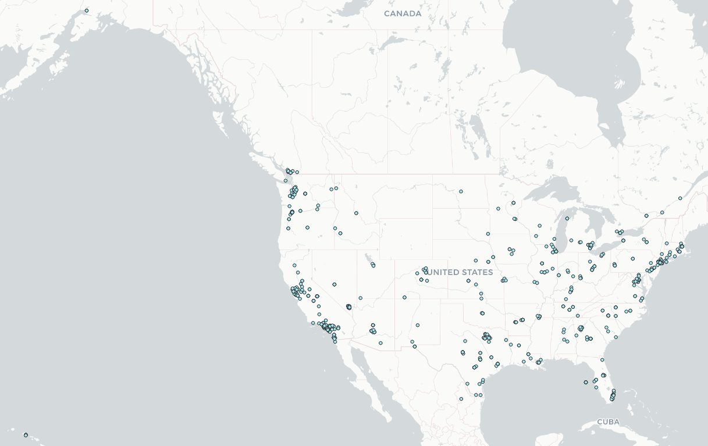
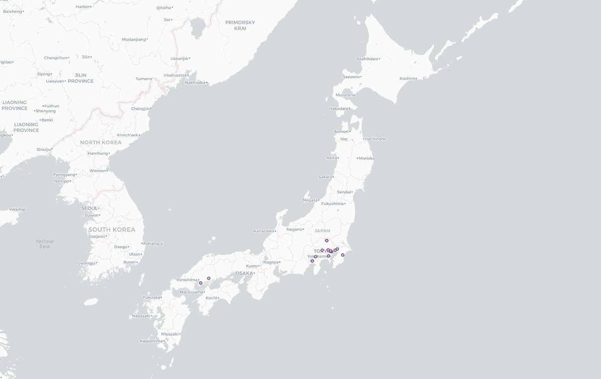
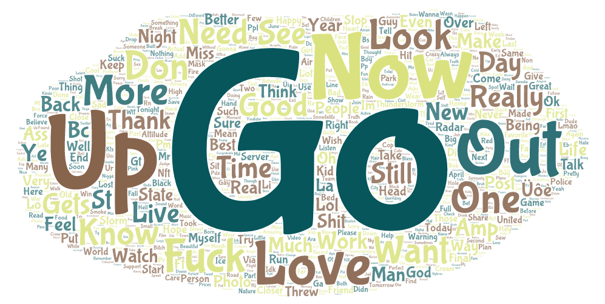
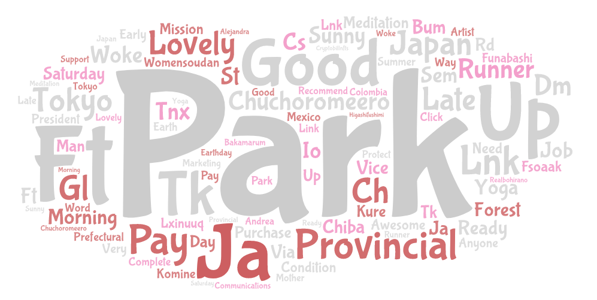

# GEOG 458: Lab 2

With the advent of technology, individual people have been able to express their ideas and be
creative, sharing their every thought on the internet. Using geographical concepts, we can analyze
this data to try to gain insights on these people, their ideas, and how they relate to the areas
they live in.

Two areas that are important to me are the United States and Japan. I live and was raised in the US,
and am interested in Japanese culture as are a lot of people. I thought it would be interesting to
investigate the Tweets and ideas shared by everyday people on Twitter from each of these countries.

These Tweets are collected during times where most "regular" people are not active on Twitter. For
the US, they were collected roughly around midnight pacific time -- many young people are likely
active, but this may influence the ideas, expressions, and users on Twitter at that time. For Japan,
the Tweets were collected around 10 AM local time, which is also probably a time of lower usage.

## Maps

### United States

### Japan

### Commentary

Overall we can see that there are much fewer tweets made in Japan during the time data was collected
versus those in the United States. This may allude to cultural differences in the usage and amount
of information shared by Japanese people on Twitter, though this may be more due to the local time
when data was collected. We may be able to infer that Americans are more active during all times of
day (i.e. late night), while Japanese people follow much more "regular" sleep and activity cycles.

We can also see that tweets from America are tagged with locations across the country, while in
Japan they tend to be more centralized in specific regions, especially the capital city of Tokyo.
This may be correlated with having less data, but in general it appears that a lot more American
locations are discussed on Twitter, as opposed to fewer locations in Japan. The United States
locations are somewhat centralized, and more dense with tweets, around major metropolitan areas,
but still fairly well distributed.

## Word Clouds

### United States

### Japan

### Commentary

The words seem to be overall a mishmash. In the United States, "Go" is the most common word --
perhaps Americans want people to "go" somewhere or "go" away? There are also more "swear" words or
potentially "adult" content in the United States.

In the Japanese Tweets, the most common word was "Park." This could suggest more outside activities
and nature than the US. This is supported by words like "Forest". There are also more "positive"
words like "lovely" and "Gl" (good luck). There also seems to be perhaps more Tweets relating to
online content creators. Vtubers are a pretty big part of online culture that originated from
Japan, and we see words like "Ft" (featuring) that may suggest collaborations between different
creators. The content of this word cloud may be affected by the small size of this corpus of data.
